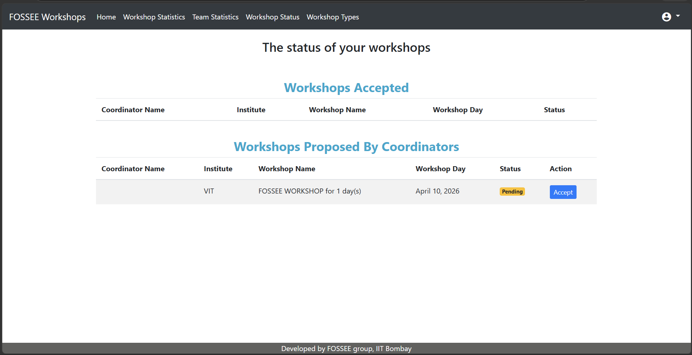
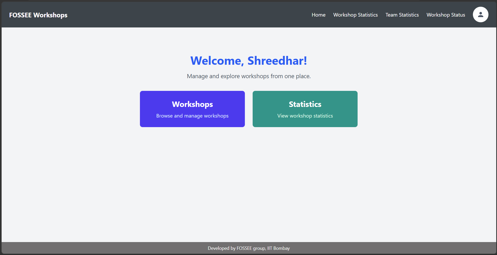
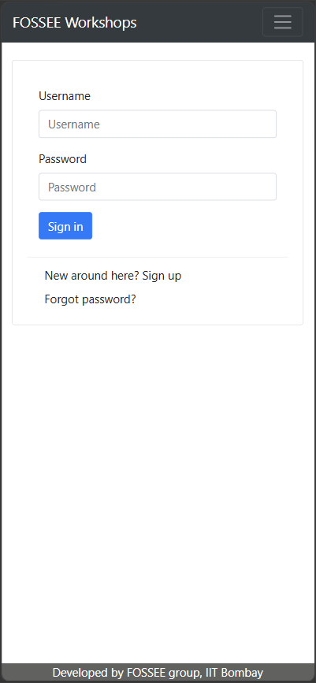
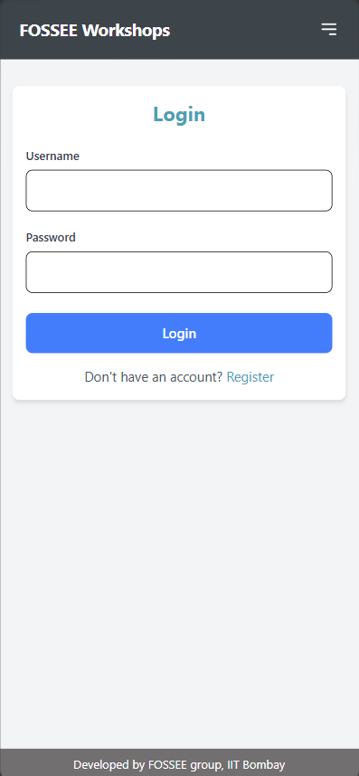
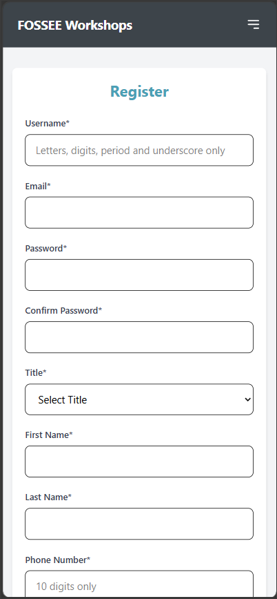
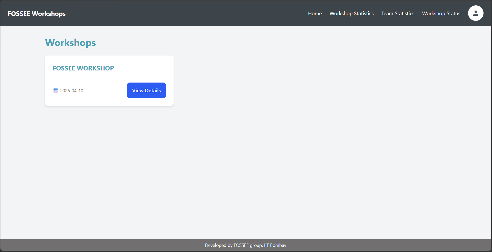
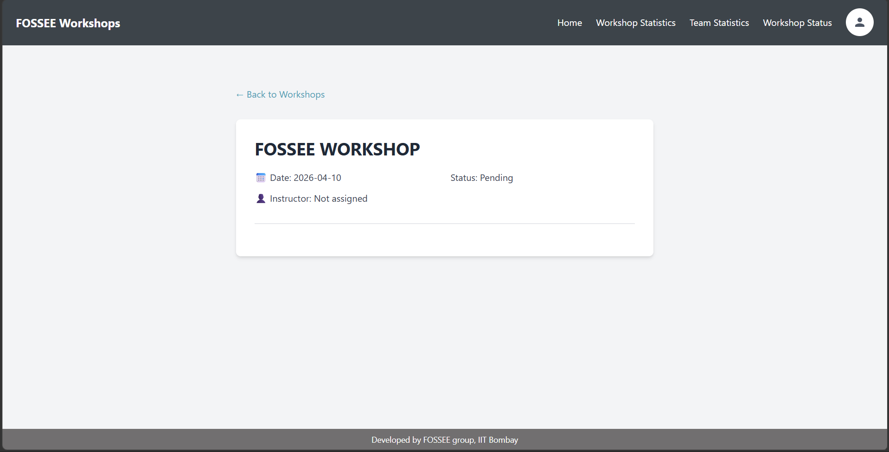
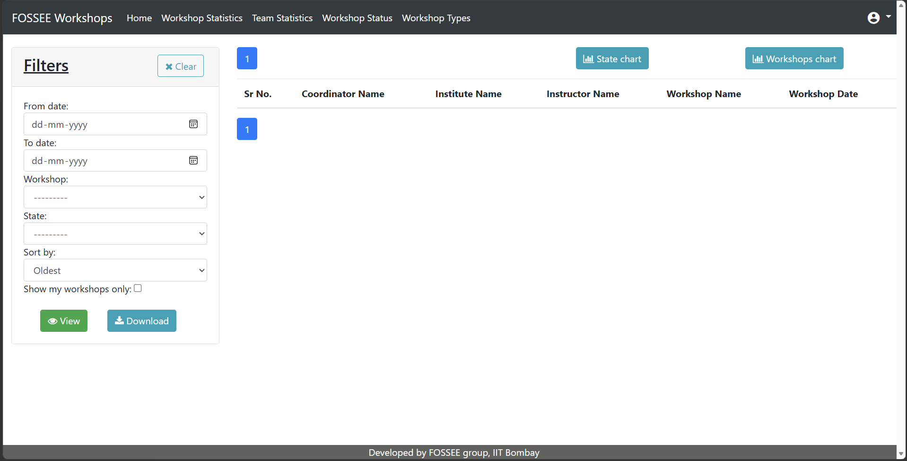

# Workshop Booking System (React + Django)

## Overview

This project is a UI/UX improvement of an existing Workshop Booking System.
The frontend is in React (Vite) and the backend is in Django.

My main focus was to make the system easier to use, especially on mobile, while keeping the backend flow unchanged.

## What Was Improved

- Mobile-first layout for better readability on small screens
- Clearer navigation flow between key pages
- Cleaner and more consistent form design
- Better visibility of important workshop details (date, location, status)
- Loading feedback during API calls
- Route-based lazy loading to reduce initial load time

## UI/UX Improvements

- Mobile-first responsive design across major pages
- Improved navigation with a hamburger menu on smaller screens
- Better form usability with clearer field structure and validation feedback
- More consistent spacing and layout patterns
- Better loading and error-state handling

## Tech Stack

### Frontend
- React (Vite)
- Tailwind CSS
- Axios

### Backend
- Django
- Django REST Framework

### Communication
- REST APIs

## Architecture

React handles the UI and user interactions.
Django handles authentication, backend logic, and database access.
Axios is used to call backend APIs from the frontend.

Flow:
User → React Frontend → Django Backend → Database → Response → UI Update

## Reasoning

### 1. What design principles guided your improvements?
I mainly followed clarity, consistency, and task-first design.
Most users come to do simple tasks like login, check workshops, or view status, so I made these actions easier to spot.
I also kept buttons, spacing, and form patterns similar across pages so the UI feels familiar while moving through the app.

### 2. How did you ensure responsiveness across devices?
I used a mobile-first approach because the portal is often used on phones.
I first fixed layouts for smaller screens, then scaled them for tablet and desktop with responsive classes.
I paid extra attention to navigation, forms, and workshop cards so users can use the app comfortably without zooming or horizontal scrolling.

### 3. What trade-offs did you make between design and performance?
I avoided heavy animations and large visual effects.
The goal was to improve usability without making the app feel slow.
I used route-level lazy loading so pages are loaded when needed instead of loading everything at startup.
This keeps the UI simple while still improving the initial load experience.

### 4. What was the most challenging part and how did you approach it?
During setup, CORS issues came up between React and Django. I fixed it by adding a simple proxy setting in the Vite config and updating one Django URL line. The backend functionality stayed the same.

The hardest part was keeping the experience consistent across login, register, workshop, and profile pages on different screen sizes.
I handled this by reusing the same layout spacing pattern, validating each flow step by step, and checking before/after screens for each important page.


## Setup Instructions

### Backend (Django)
1. Clone the repository.
2. Install dependencies:
   ```bash
   pip install -r requirements.txt
   ```
3. Apply migrations:
   ```bash
   python manage.py makemigrations
   python manage.py migrate
   ```
4. Create superuser:
   ```bash
   python manage.py createsuperuser
   ```
5. Run backend server:
   ```bash
   python manage.py runserver
   ```

### Frontend (React + Vite)
1. Move to frontend folder:
   ```bash
   cd workshop-frontend
   ```
2. Install dependencies:
   ```bash
   npm install
   ```
3. Create a `.env` file:
   ```env
   VITE_API_URL=http://localhost:8000/workshop
   ```
4. Start frontend:
   ```bash
   npm run dev
   ```


## Visual Showcase

### Homepage (Before / After)
**Before**


**After**


### Mobile Login (Before / After)
**Before**


**After**


### Mobile Register



### Workshop Pages



### Statistics Dashboard


Note: The statistics view opens the existing Django-based statistics dashboard.

## Project Demo

A short walkthrough video is included below:

Demo Video: [Watch Demo](screenshots/demo.mp4)

## Submission Checklist
- [x] Code is readable and well-structured
- [x] Git history shows progressive work (no single commit dumps)  
- [x] README includes reasoning answers and setup instructions
- [x] Screenshots included (before/after)
- [x] Code documented where necessary